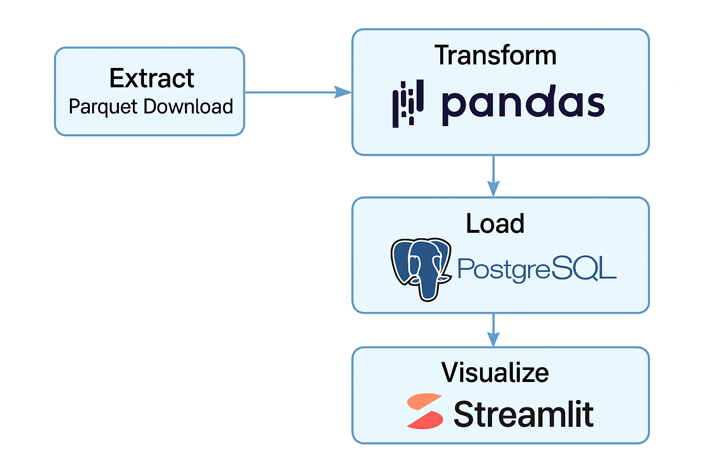

# NYC Taxi Data Engineering Project

A fully functional end-to-end data engineering pipeline for NYC Taxi data, including data extraction, transformation, loading into PostgreSQL, and interactive visualization through Streamlit.

---

## 🧭 Project Overview

This project processes monthly NYC Yellow Taxi trip data (in Parquet format), performs data cleaning and transformation, loads it into a PostgreSQL database using Docker, and provides an interactive dashboard for exploration.

---

## 🧱 Architecture



---

## 🔧 Tech Stack

- Python 3.10+
- Pandas, Matplotlib, Seaborn
- PostgreSQL (via Docker)
- Streamlit
- Parquet, pyarrow
- VS Code, Virtualenv

---

## 🚀 How to Run

### 1. Set up PostgreSQL with Docker

```bash
cd db
docker-compose up -d
```

### 2. Run the full ETL pipeline

```bash
python main.py
```

### 3. Launch Streamlit dashboard

```bash
streamlit run dashboard/app.py
```

---

## 📊 Dashboard Features

- Filter by day of week and hour of pickup
- Visualize average total fare over time
- Dynamic charts powered by live SQL queries

---

## 📂 Project Structure

```
nyc-taxi-data-engineering/
├── data/                # Raw and processed files
├── etl/                 # Extract / Transform / Load scripts
├── dashboard/           # Streamlit app
├── notebooks/           # EDA notebooks (matplotlib/seaborn)
├── db/                  # Docker PostgreSQL setup
├── main.py              # Orchestration script
└── README.md
```

---

## 🔮 Future Improvements

- Add Airflow for orchestration
- Replace Streamlit with production-grade BI tools
- Schedule monthly ingestion via cron or workflow manager

---

## 🧑‍💻 Author

Developed by [Jintaek Uh](https://github.com/jinjintaek)
